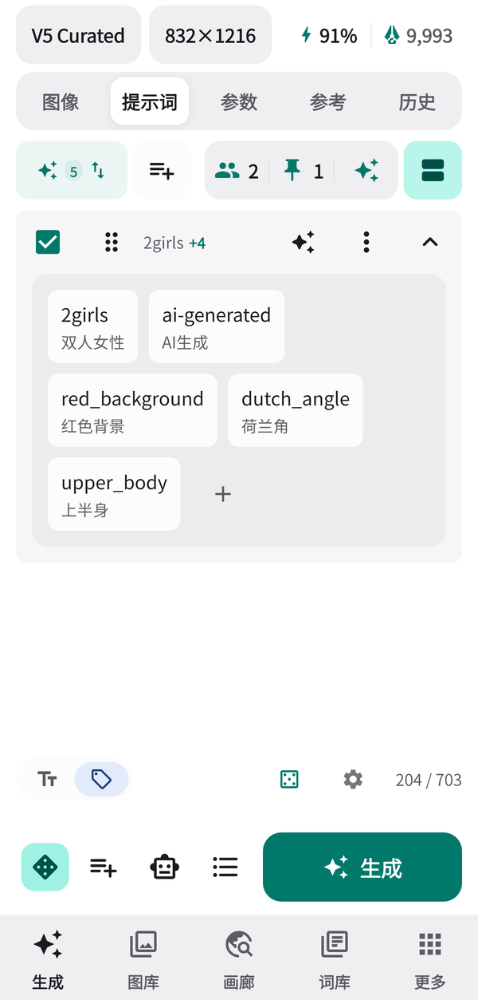
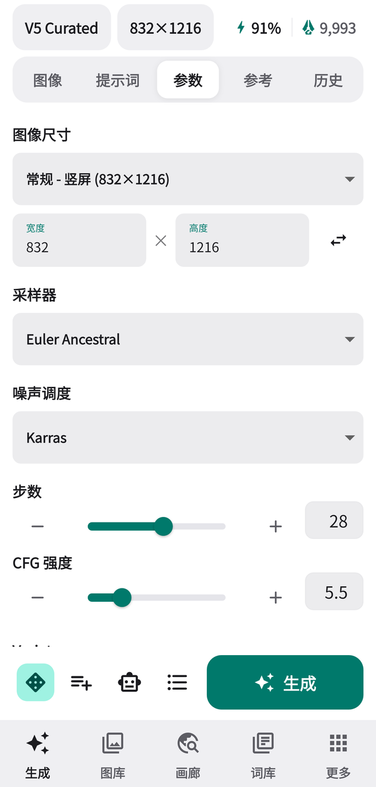
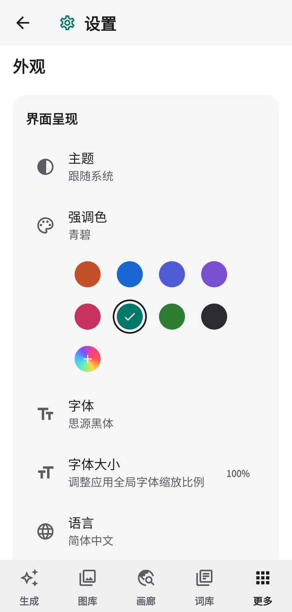

# Aaalice Pocket

  简体中文 · <a href="README.zh-TW.md">繁體中文</a> · <a href="README.en-US.md">English</a>

  

  <strong>装进口袋的 NovelAI 创作台：专为 Android 手机打磨的 NAI Launcher 分支。</strong>

  
  
  
  

  <a href="https://github.com/CSSRS2662/Aaalice_NAI_Launcher/releases/latest">下载最新版</a> ·
  <a href="https://github.com/Aaalice233/Aaalice_NAI_Launcher">上游项目</a> ·
  <a href="#-与上游的关系">与上游的关系</a>

> Aaalice Pocket 是 [NAI Launcher](https://github.com/Aaalice233/Aaalice_NAI_Launcher) 的非官方 Android 分支，由 [CSSRS2662](https://github.com/CSSRS2662) 维护，与上游作者及 NovelAI（Anlatan）均无隶属或背书关系；名称中的 “Aaalice” 沿用自上游项目名，用于标明出处。使用在线功能前，请准备自己的 NovelAI 账号，并遵守相关服务条款、内容规则与当地法律。

## 📱 专注 Android

上游 NAI Launcher 同时面向 Windows、macOS 与 Android。Aaalice Pocket 只做 Android：把手机当作主力创作设备来设计，单手可达、手势顺手、真机流畅，而不是桌面界面的缩小版。

- **只发布 Android 安装包。** 桌面端代码随上游保留以便合并，但本分支不发布 Windows / macOS 版本。
- **独立包名与签名。** 包名 `com.cssrs2662.aaalicepocket`，使用本分支自己的签名，可以和上游版本同时安装，数据互不影响。
- **定期合并上游。** 上游的新功能与修复会按需合并进来，再按手机体验重新整理。
- **不内置应用内更新。** 新版本请到本仓库的 Releases 下载后覆盖安装。

## ✨ 为手机重做的部分

| 你会注意到 | Aaalice Pocket 做了什么 |
| --- | --- |
| **生成工作台** | 顶栏只放模型与尺寸两枚胶囊，右侧是体力百分比与 Anlas 余额；下方“图像 / 提示词 / 参数 / 参考 / 历史”页签可以左右滑动切换；底栏一行放下抽卡、加入队列、智能体、队列和生成按钮，进度直接显示在生成按钮里。 |
| **提示词分区** | 提示词可以拆成多个分区分别编辑、启用和排序；复用参数时会按原来的分区恢复，不会把所有标签塞进同一个框。 |
| **标签模式** | 文本与标签两种视图随时切换，每个标签下方显示中文译文，可以长按调整权重、复制或临时禁用。 |
| **不靠 AI 的标签搜索** | 输入中文、全拼、自然码双拼或首字母都能找到英文标签，支持同音字与拼写纠错、把中文短句拆词匹配；另有随包附带、完全在本机运行的语义补全。 |
| **V5 体力与额度** | 顶栏直接显示 Opus 体力与 Anlas 余额，点开可查看剩余量、估算张数和回充时间。 |
| **Pocket 主题** | 纯白或炭黑的中性底色，搭配 8 种预设强调色或自定义颜色；浅色、深色或跟随系统。 |
| **流畅度** | 在高刷屏上，滑动等触屏操作以屏幕最高刷新率运行（如 120Hz，可在“设置 → 外观 → 高刷新率”关闭）；出图瞬间不再卡顿。 |

## 🎨 完整的 NovelAI 工作流

Aaalice Pocket 保留了上游在手机上可用的核心能力：

- **生成与编辑**：文生图、图生图、局部重绘、Focused Inpaint、扩图、变体与增强；支持 NovelAI V5 Curated / Full、V4.5、V4 与 V3 系列，参数会按模型能力自动调整。
- **角色与参考**：多角色分别设置提示词与位置；Vibe Transfer 与 Precise Reference 有独立资源库，可分类、搜索并直接送入当前任务。
- **固定词与词库**：正负面固定词、自定义标签词库与随机词库，支持分类、搜索与快速插入。
- **图库与历史**：本地图库与生成历史采用瀑布流；图片菜单统一提供保存、复用参数与收藏，可读取 NovelAI 图片元数据并选择性恢复。
- **分享导入**：从 Discord 等应用把图片或图片直链分享到 Aaalice Pocket，即可提取元数据、作为图生图源图或参考图。
- **在线画廊**：聚合 Danbooru、Safebooru、Gelbooru、AI TAG 与法典图鉴，查看原始提示词并一键送回生成页。
- **队列与智能体**：批量任务可以暂停、继续、排序和重试；智能体可以帮你查询标签、整理提示词和准备任务，付费与删除操作仍需你确认。
- **备份与恢复**：支持 GitHub 与 WebDAV 云备份，推送、拉取与恢复都由你主动开始。OneDrive 与 Google Drive 需要构建时提供 OAuth 配置，本分支的发布包未内置。

## 🖼️ 界面预览

<table>
  <tr>
    <td width="33%" align="center">
       
      生成工作台：顶栏模型、尺寸与额度
    </td>
    <td width="33%" align="center">
       
      流式预览：进度显示在生成按钮里
    </td>
    <td width="33%" align="center">
       
      标签模式：每个标签附中文译文
    </td>
  </tr>
  <tr>
    <td width="33%" align="center">
       
      参数页：尺寸、采样器与步数
    </td>
    <td width="33%" align="center">
       
      外观：强调色与明暗主题
    </td>
    <td width="33%"></td>
  </tr>
</table>

截图中的图像均由 NovelAI V5 Curated 随机提示词生成。

## ⚡ 下载与安装

1. 前往 [Releases](https://github.com/CSSRS2662/Aaalice_NAI_Launcher/releases/latest) 下载 `Aaalice_Pocket_<版本>_arm64.apk`，可用同一页面的 `checksums.txt` 核对 SHA-256。
2. 首次安装时，按系统提示允许当前应用安装未知来源软件。
3. 需要 Android 7.0 或更高版本、64 位 ARM（arm64-v8a）设备；安装包内置离线标签数据库和语义补全模型，体积约 290MB。
4. 以后升级直接覆盖安装即可，数据会保留。本分支与上游使用不同签名，不能互相覆盖安装。

登录可以使用 NovelAI 账号密码或 **Persistent API Token**。如果网页安全验证导致密码登录失败，建议改用 Persistent API Token；Token 只保存在本机安全存储中。

## 🔒 数据与隐私

Aaalice Pocket 没有自己的服务器，也不收集使用数据。只有在你主动使用对应功能时，数据才会发送给相关服务：

| 使用的功能 | 数据会发送到哪里 |
| --- | --- |
| 生成、图生图、重绘、Vibe 编码 | NovelAI；包括本次请求所需的提示词、参数和源图或参考图。 |
| 在线画廊搜索与下载 | 你选择的第三方图库；可用性、限流和内容规则由各站点决定。 |
| AI 翻译或智能体 | 你配置的模型服务；可能产生服务费用。 |
| 云备份 | 你选择的 GitHub 或 WebDAV；只上传明确勾选的内容。 |

- NovelAI Token、GitHub Token 与 WebDAV 密码保存在设备安全存储中，不会写入备份。
- 提示词、图库索引、标签、资源库和智能体会话默认只保存在本机；本地图库的图片本体不会上传。
- 在线画廊可能包含第三方内容，分级筛选不能替代你自己的判断。

## 🔗 与上游的关系

- 本分支基于 [Aaalice233/Aaalice_NAI_Launcher](https://github.com/Aaalice233/Aaalice_NAI_Launcher)，遵循同一份 [MIT License](LICENSE)，保留上游的版权声明。
- 上游的功能与修复归功于上游作者和贡献者；Android 专属的界面与改动由本分支维护。
- 使用 Aaalice Pocket 时遇到的问题请反馈给本分支，不要提交到上游仓库。反馈前可以在“设置 → 关于 → 导出诊断日志”保存排查信息。
- 想要 Windows、macOS 版本或上游的完整功能，请使用上游的 [NAI Launcher](https://github.com/Aaalice233/Aaalice_NAI_Launcher/releases/latest)。

## 🙏 致谢

感谢 [NAI Launcher](https://github.com/Aaalice233/Aaalice_NAI_Launcher) 的作者与全部贡献者，以及 [NovelAI](https://novelai.net/)、[法典图鉴](https://novelai.quicktagcloud.com/)、[AgIzT/NovelAI-Tag](https://github.com/AgIzT/NovelAI-Tag)、[ffdkj 中英标签翻译表](https://github.com/ffdkj/ffdkj-Danbooru_Tag-Chinese-English-Translation-Table)、[amenorira/danbooru-tags-data-zh](https://github.com/amenorira/danbooru-tags-data-zh)、[mozillazg/pinyin-data](https://github.com/mozillazg/pinyin-data)、[ECDICT](https://github.com/skywind3000/ECDICT)、[multilingual-e5-small](https://huggingface.co/intfloat/multilingual-e5-small)、[Flutter](https://flutter.dev/) 与 [Riverpod](https://riverpod.dev/)。随包数据与资源的许可信息见 [THIRD_PARTY_NOTICES.md](THIRD_PARTY_NOTICES.md)。

## 📄 许可证

本项目基于 [MIT License](LICENSE) 开源。NovelAI 及其标志是 Anlatan 的商标，本项目不主张任何相关权利。
